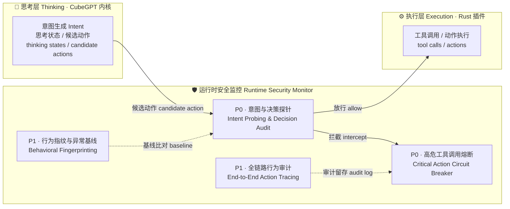

<div align="center">

# DistributedFormer

**事件驱动的脉冲神经网络智能体框架** · 内嵌模型 **CubeGPT** · 插件标准 **CuteMamen**

以 16 参数脉冲神经元为基本单元 · CubeGPT 立方体连接多模态脉冲大模型 · KV 堆工作记忆 · 多智能体脉冲工作流
· CuteMamen 固定内核 + 专家思考插件
面向流式监控、异常检测等持续在线场景

[](https://github.com/1person280/DistributedFormer/actions/workflows/ci.yml)
[](https://www.python.org)
[](LICENSE)
[](docs/CHANGELOG.md)
[](#安全架构宣言--security-architecture-manifesto)

</div>

---

## 这是什么

DistributedFormer 探索一条不同于 Transformer 的路线：**用超简单的神经元（每个恰好 16 个标量参数）+
事件驱动的异步脉冲传播**，构建可以 7×24 持续在线、按事件触发计算的智能体网络。它的目标场景是
"永远在线的流式监控"——市场异动检测、指标巡检、IoT 阈值告警——这类任务不需要大模型的重算力，
需要的是低延迟、事件驱动和持久的工作记忆。

框架内嵌的模型是 **CubeGPT**：
**Cube** 指连接方式——numeric / text / timeseries / image 四个模态面构成立方体的四个侧面，
以"棱"环形侧连（每步把本面脉冲聚合注入邻面）；**GPT** 则是向 ChatGPT 致敬的命名
（这里不妨戏称其为 Generative Pulse Transformer）。
规模为 4 面 × ~4,400 单元 × 16 参数 ≈ **281K 参数**，纯 numpy 即可运行。

核心机制一览：

|机制|说明|
|-|-|
|**CubeGPT**|4 个模态面（每面 = 16 单元输入端口 + 深度 2 分形皮层 4,368 单元）环形侧连 + 顶层 OutputModule 头部，4×4,400×16 ≈ 281K 参数|
|**CubeGPTKernel** (v0.7.2)|模型精简形态：内核只留必要思考（棱路由 / KV 记忆 / 输出头 / 节律），皮层计算全部外移为 FacePlugin 思考插件|
|**CuteMamen 内核** (v0.7.2)|通用固定内核（Nest）：路由器 + 工作记忆 + 插件注册表 + 内存预算 LRU 淘汰，随用随载热加载|
|**RustCodingPlugin** (v0.7.3)|内嵌 100 段真实 Rust 语料的思考插件：训练材料 `training_data()` 导出 + 最近原型分类（每类原型权重随包往返）|
|**16 参数脉冲单元**|集成放电模型：输入门控 + 状态反馈 + 疲劳/不应期 + 自发放电（默认模式网络，无输入仍"持续思考"）|
|**多模态顶层模块**|numeric / text / timeseries / image 四种模态各拥有独立的 16 单元输入模块（含绑定编码器），输出为独立顶层 OutputModule，模态按权重融合进思考层|
|**分形递归**|每层 16 单元，深度 d 的思考层含 Σ16^k (k=1..d+1) 个单元，深度 2 ≈ 4,368 单元 / 69K 参数|
|**KV 堆记忆**|分布式持久 KV 存储（余弦相似度检索 + 时间衰减 + LRU 淘汰），替代 Transformer 的 KV Cache|
|**5 类脉冲智能体**|感知 / 推理 / 动作 / 记忆 / 节律，共享全局 KV 堆，脉冲每跳衰减 ×0.7|
|**节律调制**|120 步周期（80 步思考 + 40 步抑制），模拟昼夜节律的全局兴奋/抑制切换|
|**STDP 可塑性**|脉冲时序依赖学习（LTP/LTD），与监督信号协同|

## 安全架构宣言 · Security Architecture Manifesto

> **Traditional Transformers are black boxes where intent and action are coupled,
> making "AI escape" hard to detect. DistributedFormer changes the game by
> decoupling the CubeGPT core (thinking) from the Rust execution layer. This
> architecture natively supports a Runtime Security Monitor, allowing us to
> audit intent before execution.**
>
> **传统 Transformer 是黑盒：意图与行动耦合，使"AI 逃逸"难以检测。
> DistributedFormer 通过解耦 CubeGPT 内核（思考）与 Rust 执行层（行动）改变了
> 这一局面——这种架构原生支持运行时安全监控，使我们能够在执行之前审计意图。**

**Why DistributedFormer is Safer: Decoupled Intent & Execution allows Real-time Auditing.**
**为什么 DistributedFormer 更安全：意图与执行解耦，实现实时审计。**



思考与执行解耦不是 DistributedFormer 的一个附属特性，而是架构层面带来的
安全红利：意图在进入执行层之前必须经过独立的监控面。四个安全方向按优先级
推进（详见下方路线图「安全AI」一节），目标里程碑 **v0.9.0 Safety Shield**。

## 快速开始

### 安装

```bash
pip install -e .
# 可选: 真实行情数据源
pip install -e ".[realtime]"
```

依赖极轻：核心只需要 `numpy`。

### 命令行

```bash
# 端到端演示: 3 只股票的持续监控脉冲网络（模拟数据）
dformer demo --cycles 10 --interval 0.5

# 长驻监控服务（Docker/生产默认入口）
dformer serve --tickers AAPL TSLA NVDA --interval 300

# 使用真实行情 (yfinance)
dformer serve --realtime --interval 300

# 真实数据训练 (Rust 编码基准, v0.7.5)
dformer train --depth 1 --epochs 10

# 模块自检
dformer test

# 终端聊天: 与 CubeGPT 对话 (v0.7.1)
dformer chat
```

### 作为库使用

```python
from distributedformer import CubeGPT, KVStack

kv = KVStack(capacity=10000, dim=16)
gpt = CubeGPT(depth=2, dim=16)   # 深度2 = 281K 参数

# 4 个模态面独立编码, 立方体棱环形侧连, 顶层输出模块生成动作脉冲
spikes = gpt.step({
    "numeric": 1.5,              # 标量或向量
    "text": "market surges",     # TF-IDF 稀疏编码
    "timeseries": [1, 2, 4, 3],  # 差分编码
    "image": gray_image_2d,      # 4×4 池化空间编码
})
```

## 模态面存档

### .dfpkg：模态面独立存档 (v0.7.0)

每个模态面可以独立打包为 `.dfpkg` 存档（遵循 CuteMamen 包格式精神：
单个 tar.gz，内含 `manifest.json` 清单 + `weights/` 权重 + `memory/` 状态），
支持自由导入导出与随用随载热加载：

```python
gpt = CubeGPT(depth=1, dim=16, modalities=["numeric", "text"])

# 导出: 把 text 面打包成独立存档
gpt.export_face("text", "text.dfpkg", author="me", capability="文本语义计算")

# 卸载: 自动先导出 pkg 再从内存移除 (可随时恢复)
gpt.unload_face("text")                    # 默认存到 cache/face_pkgs/text.dfpkg
gpt.list_faces()                           # {'loaded': ['numeric'], 'registered': ['text']}

# 随用随载: 注册后不占内存, step() 用到该模态时现场热加载
gpt.register_face_pkg("cache/face_pkgs/text.dfpkg")
spikes = gpt.step({"text": "hello"})       # 触发热加载, 之后常驻

# 或显式加载 / 导入到另一个模型
gpt2 = CubeGPT(depth=1, dim=16, modalities=["numeric"])
gpt2.import_face("text.dfpkg")             # 权重 + 状态逐位还原
```

`manifest.json` 含模态/深度/dim/单元与参数规模/内存占用，带 `min_core_version`
兼容性检查（内核过旧拒绝加载）。权重与状态逐位可复现：感受野投影由 layer_id
的 crc32 种子重建，小世界连接随 STDP 训练后的真值一起存档。

### .CuteMamen 标准 (v0.7.2)

v0.7.0 的模态面 pkg 是首个特例；v0.7.2 把它泛化为完整的插件标准实现：

**一个轻量级固定内核（Nest）+ N 个独立训练的专家思考插件。**
只有被路由激活的插件消耗算力，空闲的专家零成本——通过彻底消除空闲计算，
与每次请求激活全部参数的单体模型形成架构级差异。

```python
from distributedformer.cutemamen import (
    CuteMamenKernel, ExpertPlugin, LoRAAdapter, LoRABridgePlugin,
    save_pkg, load_pkg,
)

# ── 1. 写一个思考插件: 只需实现生命周期钩子 ──────────────
class TrendPlugin(ExpertPlugin):
    BASE_MODEL = "generic"          # manifest.base_model (加载注册表按它分发)

    def on_think(self, event, ctx): # 事件到达、被路由激活 → 核心计算
        value = event["data"]
        history = ctx.working_memory.kv_stack  # 内核工作记忆
        ctx.emit("trend.computed", value)      # 事件总线: 插件间通信
        return {"trend": value > 0}

# ── 2. 内核只做路由 / 工作记忆 / 内存调度, 不含任何专家计算 ──
kernel = CuteMamenKernel(dim=16, memory_budget_mb=64)
kernel.mount(TrendPlugin("trend", route="numeric"))
kernel.bus.subscribe("trend.computed", lambda e: print("事件总线:", e))

kernel.think({"topic": "numeric", "data": 1.5})   # 路由 → on_think
# 生命周期广播: plugin.loaded / plugin.unloaded / plugin.evicted / kernel.think

# ── 3. .CuteMamen 专家插件包: 存档 / 传输 / 随用随载 ─────
ad = LoRAAdapter("wq", a=..., b=..., alpha=2.0)    # ΔW = (α/r)·B@A
plugin = LoRABridgePlugin("lora-wq", adapter=ad)   # LoRA ↔ 插件桥接
kernel.mount(plugin)
save_pkg(plugin, "lora-wq.CuteMamen")              # manifest + weights + 三级记忆
kernel.unmount("lora-wq")                          # 卸载自动存档并注册
kernel.think({"topic": "lora-wq", "data": x})      # 用到时现场热加载
```

标准要点（全部已实现，106 项测试覆盖）：

|规范条款|实现|
|-|-|
|生命周期钩子 `on_load` / `on_think` / `on_unload`|`ExpertPlugin` 基类托管，内核按序调用|
|三级记忆存档 working / episodic / semantic|`PluginMemory`，随包 `memory/` 目录存档还原，情景→语义自动蒸馏|
|事件总线通信|`EventBus` pub/sub + `*` 通配 + 生命周期广播 + 插件间消息|
|内存预算淘汰|manifest 声明占用，超预算 LRU 淘汰（先自动存档，绝不淘汰正在思考的专家）|
|`.CuteMamen` 包格式|单个 tar.gz：`manifest.json` + `weights/` + `memory/`|
|解码器层集中兼容|v1 清单自动适配（`model_type`→`base_model`、`on_init`→`on_load`），未知字段保留|
|LoRA/Adapter 兼容桥接|`LoRABridgePlugin`（ΔW·x 低秩贡献）+ `lora_from_weight` SVD 导出|
|`min_core_version` 检查|内核过旧拒绝加载|

**演进规则**：允许破坏性变更，解码器吸收迁移成本（内核永远只看一种内部格式），
`migrate-v1-to-v2` 命令自动转换旧版插件包（随 `pip install -e .` 安装）：
`migrate-v1-to-v2 ./plugins/ --recursive --dry-run`（预览）/ `--strict`（无法
映射字段时报错）/ `--backup`（迁移前备份）。

> **原则：可以往插座上多加孔，但不能把已有的孔堵上。**
> 完整兼容性规范见 [COMPATIBILITY.md](./docs/COMPATIBILITY.md)。DistributedFormer
> v0.7.2 即是一个完整参考实现。

### 模态面内核：CubeGPTKernel (v0.7.2)

按"模型只保留必要思考，其余思考交给插件"的原则，CubeGPT 有了内核形态
`CubeGPTKernel`——经典 CubeGPT 的职责被重新划分：

|经典 CubeGPT 职责|CubeGPTKernel 中的去向|
|-|-|
|模态面皮层计算|**外移** → `FacePlugin` 思考插件（可卸载 / 热加载 / 预算淘汰）|
|立方体棱（邻面脉冲注入）|内核路由（必要思考）|
|KV 堆注意力|内核工作记忆（必要思考）|
|输出头（16 单元）|内核最小读出（必要思考）|
|节律调制|内核（必要思考）|
|STDP 协调 / 内存预算 / 随用随载|内核生命周期职责（新增）|

```python
from distributedformer import CubeGPT
from distributedformer.cutemamen import CubeGPTKernel

gpt = CubeGPT(depth=1, dim=16)          # 经典形态
kernel = gpt.to_kernel()                # 零拷贝转换: 同一面对象 / KV 堆 / 输出头
kernel.step({"numeric": 1.0, "text": "hello"})   # API 与经典形态一致

# 直接构造: 每个面挂载为思考插件, 内核自身只有 16 个输出头单元
kernel = CubeGPTKernel(depth=2, dim=16, memory_budget_mb=64)
kernel.step({"numeric": 1.0, "text": "..."})     # 预算紧张时面被淘汰→自动存档
kernel.step({"text": "..."})                     # 再用到时从注册表热加载
```

经典 `CubeGPT` 保留为训练基底与一体化形态，两者共享同一套面 pkg
（`.dfpkg` ⇄ `.CuteMamen` 双向可载）。

## 远程服务器部署

### Docker

```bash
cd src/deployment
docker compose up -d          # Redis + 2 个监控节点
docker compose --profile monitoring up -d   # 加 Prometheus
```

Kubernetes 清单（Deployment / Service / HPA / ConfigMap）见
[`src/deployment/k8s/`](src/deployment/k8s/)。

## 实验记录（诚实公开）

本项目归档全部研发记录，包括**负结果**。

### 合成数据（v0.0–v0.7.5，已归档）

在合成 4 分类股票任务上，消融实验显示
基线准确率 30%、深度 2 大网络 22.5%——**扩大分形规模与思考层监督在该任务上没有正向增益**，
模型停留在随机水平附近。v0.5.0 修复两个动力学缺陷（均值池化 → 感受野投影；
恒定调制淹没输入 → 权重配平）后，读出层在合成任务上达 64.8% ± 4.5%
（5 种子，随机基线 25%）——方法学得到验证；合成任务随即被真实数据取代。

### 真实数据（v0.7.5–今，当前 v0.8.6）

训练/评估管道 100% 采用真实 Rust 编码基准语料（502 段真实代码 × 5 类
真实 rustc 错误，随机基线 20%）。准确率轨迹（均为真实数据、5 种子）：

| 版本 | 变更 | 协议 | 验证准确率 |
|------|------|------|------------|
| v0.7.5 | 词袋 TF-IDF 编码（诊断基线） | 冻结水库 + 线性读出，75/25 | 36%（28%–44%）|
| v0.8.0 | P0 双模态注入 | 同上 | 57.6%（52%–64%）|
| v0.8.1 | P1 结构感知编码 | 同上 | 61.6%（48%–72%）|
| v0.8.2 | P1 持久输出头（端到端） | 端到端监督训练 | 67.2%（56%–80%，最佳验证）|
| v0.8.3 | P2 交叉验证评估 | 5 种子 × 5 折分层 CV | 63.8% ± 10.0%（45%–85%）|
| v0.8.4 | P2 扩真实语料 100 → 502 段 | 同上 | **75.6%**（种子均值 74.7%–76.3%，±0.8%）|
| v0.8.6 | 知识迁移：主模型读出层 → Rust 思考插件（分布式架构） | 5 种子 × 5 折，插件路由推理 | **76.7%**（与主模型直评逐折一致）|

v0.8.4 的 25 次折评估全部超过随机基线（20%）；扩语料后读出层准确率
提升 11.8 个百分点，**种子间评估方差从 ±5% 收窄至 ±0.8%**（达到 P2
的 ±2% 目标），折级 ±3.9% 为每折 ~100 验证样本的二项统计下限
（p=0.75 时抽样噪声 ~±4.3%），属统计噪声而非方法不稳定。折级明细见
[src/experiments/readout_report.md](src/experiments/readout_report.md)。

**如实报告的负面观察**：
- 端到端训练（v0.8.2）存在后期漂移：67.2% 为早停选取的最佳验证，
  最终 epoch 回落至 36%–60%（详见已知问题）
- 读出层训练准确率从恒为 100%（100 段小语料）降至 ~97%（502 段），
  小语料过拟合迹象显著缓解，但训练/验证仍有约 20 个百分点间隙

## 训练材料

### Rust coding 真实基准 (v0.6.0)

针对"训练监督以合成数据为主、知识脱离实际"的限制, 新增首个真实需求基准:
**静态识别 Rust 代码命中的编译错误类别**——lints / IDE 提示 / 自动修复工具
的基础能力。

* **数据**: 502 段真实风格 Rust 代码 × 5 类 (所有权移动 E0382 / 借用冲突
  E0502·E0499 / 生命周期 E0597·E0106 / 类型不匹配 E0308·E0277 / 合法代码;
  v0.8.4 P2 由 100 段扩充, 新增 rustc 错误索引官方样例 + 真实 crate
  编译失败样本), 每条附真实 rustc 错误码与报错信息, 见
  [`src/data/rust_coding.py`](src/data/rust_coding.py)
* **输入模态**: text (代码原文, 代码感知分词) + numeric (静态扫描特征)
* **结果**: CubeGPT 读出层 5 种子验证准确率 **57.6% ± 10.3%**, 全部超过
  随机基线 20% (v0.6.0 初版为 54.4% ± 5.4%, 修复 CubeFeatureExtractor
  可复现性后复测提升), 见
  [`src/experiments/rust_report.md`](src/experiments/rust_report.md)
  * 各类别 (种子均值): 借用冲突 76% / 生命周期 88% / 所有权移动 48% /
    类型不匹配 44% / 合法代码 32%
* 复现: `python src/experiments/rust_benchmark.py`

### RustCoding 思考插件 (v0.7.3)

把 v0.6.0 的真实语料装进一个 CuteMamen 专家插件, **填补训练材料空白**:
训练监督不再只有合成随机数据, 插件自带真实 Rust 代码 × 5 类真实
rustc 错误作为可调用的训练/评估材料, 内核无需额外数据源
(语料随 v0.8.4 P2 扩充至 502 段)。

```python
from distributedformer.cutemamen import CuteMamenKernel, RustCodingPlugin
kernel = CuteMamenKernel(dim=16)
plugin = RustCodingPlugin("rust-coding")            # route 默认 "rust"
kernel.mount(plugin)

# 训练材料: 直接导出真实特征 + 标签, 供端到端训练 (路线图数据通路)
X, y = plugin.training_data()                       # (100, 10) / (100,)

# 现场思考: 分类一段 Rust 代码命中的编译错误类别
result = kernel.think({"topic": "rust",
                       "data": "fn longest(s1: &str, s2: &str) -> &str {\n  ...\n}"})
# [{'label': 'lifetime', 'label_name': '生命周期', 'rustc': 'E0597/E0106/E0515/E0716', 'confidence': ...}]

# 存档 / 随用随载: 原型权重 (每类 static_metrics 质心) 随包往返
save_pkg(plugin, "plugin/MyRust.CuteMamen")
loaded, manifest = load_pkg("plugin/MyRust.CuteMamen")  # base_model=rust.coding
```

可学习权重 = 每类别原型特征向量, 经 `.CuteMamen` 包 weights/ 存档还原;
分类用最近原型 + softmax 置信度, 结果广播 `rust.classified` 事件供插件间订阅。

## 路线图

- [x] v0.2.0 — 产品化重构：可安装包 / CLI / serve 长驻服务 / 真实行情数据源 / 测试与 CI / 修复 Docker 链路
- [x] v0.3.0 — 多模态顶层模块化：四种模态独立输入模块 + 独立输出模块 + 确定性图像编码
- [x] v0.4.0 — 内嵌模型正式命名为 **CubeGPT**（立方体棱连接，4 面 × 4,400 单元 ≈ 281K 参数），智能体框架全面切换
- [x] v0.5.0 — 三项核心修复：KV 注意力接入主计算路径 / 训练方法学验证
  （读出层 64.8% vs 随机 25%，实验 R1）/ 真实桌面通知与 HTTP 动作
- [x] v0.6.0 — 真实数据基准起步：Rust coding（100 段真实代码 × 5 类真实 rustc 错误），
  读出层 57.6% ± 10.3% vs 随机 20%（复测值，初版 54.4%）；同步修复文本编码器的进程随机哈希（不可复现）与丢 token 问题
- [x] v0.7.0 — 模态面独立化与 **pkg 存档**：随用随载热加载 / 自由导入导出具体模态面
  （`.dfpkg`，兼容 CuteMamen 包格式）；同步修复训练报告占位符问题
- [x] v0.7.1 — 简单的聊天框：`dformer chat` 与 CubeGPT 对话
- [x] v0.7.2 — **CuteMamen 插件标准落地**：通用固定内核（路由器 + 工作记忆
  + 插件注册表）与 `.CuteMamen` 专家插件包（on_load/on_think/on_unload 生命周期钩子、
  三级记忆存档、事件总线通信、内存预算淘汰、LoRA/Adapter 兼容桥接）；
  **模型精简**为 CubeGPTKernel——必要思考留内核，皮层计算全部由思考插件实现
- [x] v0.7.3 — **Rust coding 思考插件**：内嵌 100 段真实 Rust 语料作训练材料
  填补训练数据空白（`training_data()` 数据通路），每类原型权重随包往返热加载
- [x] v0.7.4 — **KV 堆注意力检索向量化**：打分与 top-k 全程 numpy 批量计算
  （`KVStack` 增量矩阵索引 + swap-remove 淘汰），主计算路径检索提速约 40 倍
  （4096 条堆 54ms → 1.3ms），行为与旧逐条打分实现数值一致
- [x] v0.7.5 — **训练数据真实化**：彻底移除合成训练数据（删除
  `data_generator.py`），训练/评估管道 100% 采用真实 Rust 编码基准语料
  （`RustCodingTrainingDataset`），训练器泛化为 5 类，统一输出随机/多数类
  评估基线；真实数据读出层验证 28%–44%（5 种子均值 36%）vs 随机 20%
- [x] v0.8.0 — **P0 双模态注入**：诊断定位 36% 瓶颈在词袋编码阶段
  （类间/类内距离比 0.68 负可分），`static_metrics` 语法特征走 numeric
  通路 + 代码原文走 text 通路，真实数据读出层验证 **57.6%**（52%–64%，
  5 种子），超随机基线 2.9 倍
- [x] v0.8.1 — **P1 结构感知编码**：新增 `structure_metrics` 6 维结构特征
  （`&mut` / 返回引用 / 类型标注 / println / let / 防御调用），与 10 维
  `static_metrics` 拼成 16 维填满 numeric 通路，读出层 57.6% → **61.6%**
  （48%–72%，5 种子）
- [x] v0.8.2 — **P1 修端到端权重更新**：注入-恢复启发式替换为**持久输出头**
  （在线 softmax 线性头，权重跨样本/epoch 持久），`w_in` 更新从均值池化
  改为每单元感受野投影——端到端监督训练从刚至基线（20%）跃升到
  **67.2%**（56%–80%，5 种子最佳验证）
- [x] v0.8.3 — **P2 交叉验证评估**：`stratified_kfold` 分层 K 折替代单次
  75/25 划分，5 种子 × 5 折共 25 次折评估——读出层 **63.8%**（45%–85%，
  全部 25 折超随机基线），评估不依赖划分运气
- [x] v0.8.4 — **P2 扩真实语料**：语料 100 → 502 段，读出层 **75.6%**
  （种子方差 ±0.8%），准确率瓶颈方案收官
- [x] v0.8.5 — **插件独立交付**：思考插件以 `.CuteMamen` 独立包文件交付
  `plugin/` 目录，内核按路由主题随用随载热加载
- [x] v0.8.6 — **新阶段 · 分布式架构**：主模型 Rust 知识迁移到思考插件
  （`migrate_from_main_model()`，76.7% 与主模型直评逐折一致）；代码扁平化
  到 `src/`，文档整理到 `docs/`，项目结构清理
- [x] v0.8.7 — **更整洁的项目**：运行时缓存统一到 `./cache`（插件/面
  自动存档 + pytest 缓存 + Python 字节码缓存集中一处）；清理废弃路径与
  一次性临时文件；新增 `plugin/VideoMaking.CuteMamen` 轻量视频生成插件
  （关键帧 + 镜头运动曲线 → 缓动仿射帧序列，纯 numpy 零 GPU）
- [ ] 分类式 token：一个 token 占 64 比特数据，纯文本场景下前 32 比特为
  token 组、后 32 比特直接为 utf8-mb4 字符；设硬性分组，如
  `0x00000000xxxxxxxx` 保留为 utf8-mb4 字符 token 组
- [ ] CubeGPT 端到端可学习：在真实数据集上端到端训练（Rust 基准已提供数据通路, RustCodingPlugin 导出 X/y）
- [ ] Redis 分布式 KV 堆在多节点工作流中实际启用
- [ ] 学习规则改进：目标是在 ≥2 个真实任务上显著超过随机基线

### ~~准确率瓶颈解决方案（36% 瓶颈，v0.7.5 诊断结论）~~ ✅ 已完成（v0.8.4）

36% → 75.6%（随机基线 20%，5 种子 × 5 折 CV，种子方差 ±0.8%）。

特征通路诊断（同一真实语料、同一线性读出层、5 种子分层划分）定位了
读出层 36% 的瓶颈：**判别信息在编码阶段即丢失**——词袋 TF-IDF 哈希的
类间/类内距离比 0.68（负可分），而纯静态语法特征 `static_metrics`
可达 71.2%。据此排定五个提升方向（按优先级）：

1. **P0 · 双模态注入** ✅ **已完成（v0.8.0）**：`RustCodingTrainingDataset`
   把 `static_metrics`（语法扫描特征）走 numeric 通路 + 代码原文走
   text 通路，读出层用 `CubeFeatureExtractor`（v0.6.0 双模态曾达
   57.6%，纯静态特征诊断 71.2%）——实测 **57.6%**（52%–64%，5 种子）
2. **P1 · 结构感知编码** ✅ **已完成（v0.8.1）**：新增 `structure_metrics`
   6 维结构特征（`&mut` 位置 / 返回引用 `-> &` / 类型标注 / println /
   let 绑定 / 防御调用），与 10 维 `static_metrics` 拼成 16 维恰好
   填满 numeric 通路——直击 move↔lifetime 互混与 type→ok 误判的
   混淆源，读出层 **57.6% → 61.6%**（48%–72%，5 种子）
3. **P1 · 修端到端权重更新** ✅ **已完成（v0.8.2）**：注入-恢复启发式
   （临时改 gain/threshold 再还原，学习信号不累积）替换为**持久输出头**
   （在线 softmax 线性头，权重跨样本/epoch 持久）；`w_in` 更新从
   `error × mean(input)` 均值池化改为**每单元感受野投影**
   `error × (receptive @ input)`——端到端监督训练从刚至基线（20%）跃升到
   **67.2%**（56%–80%，5 种子最佳验证），全部种子超随机基线 3 倍以上
4. **P2 · 扩真实语料** ✅ **已完成（v0.8.4）**：`RUST_SNIPPETS` 100 → 502 段
   （rustc 错误索引官方样例 + 真实 crate 编译失败样本：E0382/E0505/
   E0507/E0502/E0499/E0597/E0106/E0515/E0716/E0623/E0308/E0277/E0599/
   E0300 + mpsc/spawn/容器/entry 冲突/serde_json 所有权转移等真实模式），
   每折验证集 25 → ~100——实测读出层 **75.6%**（种子均值 74.7%–76.3%
   即 **±0.8%**，达到 ±2% 目标；此前 100 段语料为 63.8%、种子均值
   ±5%），扩语料带来 +11.8 个百分点提升，**准确率瓶颈解决方案全部收官**
5. **P2 · 5 折交叉验证** ✅ **已完成（v0.8.3）**：`stratified_kfold`
   分层 K 折（每类别轮流分折，折间比例一致），`run_cross_validation`
   每种子 5 折 × 5 种子共 25 次折评估，替代单次 75/25 划分——实测
   **63.8%**（折展平 ±10.0%，折范围 45%–85%，种子均值 57%–67%，
   全部 25 折超随机基线），与 v0.8.1 单次划分结论（61.6%）一致，
   评估不再依赖划分运气

### 安全AI（AI 运行时安全监控模块）

利用思考层（CubeGPT 内核）与执行层（Rust 插件）解耦的架构优势，
在内核与插件之间建立独立的运行时安全监控面（见上方[安全架构宣言](#安全架构宣言--security-architecture-manifesto)）。
目标里程碑 **v0.9.0 Safety Shield**。四个方向按优先级排定，**已全部落地（v0.9.2）**：

1. **P0 · 意图与决策探针（Intent Probing & Decision Audit）** ✅ **已完成（v0.9.0）**：在模型
   生成下一步行动或工具调用参数之前，实时扫描其"内部决策日志"
   （思考状态 / 事件总线上的候选动作）；内置轻量级安全分类器判断
   当前决策是否包含越权、获取高权限指令或探索系统边界等逃逸倾向，
   命中即在下发前拦截（`src/security_monitor/intent_probe.py`）
2. **P0 · 高危工具调用熔断机制（Critical Action Circuit Breaker）** ✅ **已完成（v0.9.0）**：
   建立动态的工具调用权限围栏——对高风险操作（修改系统配置、访问
   核心数据库、下载未白名单外部代码等）不直接交由 Rust 执行层执行；
   系统拦截该调用，触发异步或同步深度安全审核（可升级为人工介入），
   确认合规前拒绝下发（`src/security_monitor/circuit_breaker.py`）
3. **P1 · 行为指纹与异常基线检测（Behavioral Fingerprinting &
   Baseline Deviation）** ✅ **已完成（v0.9.2）**：`observe/learn` 在正常业务
   流量上累积每工具频率基线；实时监控调用频率（窗内突发/基线偏离）、
   参数熵值（扫描式枚举载荷）及请求链路的逻辑关联性（任务外底层系统
   指令），命中即判定异常并告警（`src/security_monitor/behavioral_fingerprint.py`）
4. **P1 · 全链路行为审计与溯源（End-to-End Action Tracing）** ✅ **已完成（v0.9.2）**：对
   "产生想法 → 执行动作"全流程结构化日志留存——思考状态、决策依据、
   工具参数、执行结果四元组绑定存储（全局 action_id 主键）；`replay/query/export`
   支持安全事件完整复盘溯源，满足强监管行业的合规审计需求
   （`src/security_monitor/action_tracer.py`）

### 已知问题（v0.8.4 状态）

* ~~KV 堆注意力未接入主计算路径~~ **已修复（v0.5.0）**：`KVStack.retrieve()` 现为
  FractalLayer / 输入端口 / 输出头的真实注意力来源，记忆影响网络动力学；
  推理时输出状态持续写入 KV 堆，形成闭环。带 scan_limit 限额防止大堆拖慢。
* ~~训练方法学未验证~~ **已验证（v0.5.0，实验 R1）**：修复两个动力学缺陷
  （均值池化 → 感受野投影；恒定调制淹没输入 → 权重配平）后，水库内部状态 +
  线性读出层在合成 4 分类任务上取得 **64.8% ± 4.5%** 验证准确率（5 种子，
  随机基线 25%），全部种子稳定超过基线。见
  [`src/experiments/readout_report.md`](src/experiments/readout_report.md)。
* ~~桌面通知 / API 调用为模拟~~ **已实现（v0.5.0）**：Windows 真实系统通知
  （PowerShell toast，`DF_NOTIFY_MODE=sim` 可切回打印）；真实 HTTP POST
  （stdlib urllib，endpoint 或 `DF_WEBHOOK_URL` 配置，10s 超时，失败降级不中断）。
* ~~训练监督以合成数据为主~~ **已起步（v0.6.0）**：新增 Rust coding 真实需求
  基准（真实代码 + 真实 rustc 错误类别），读出层 57.6% ± 10.3% vs 随机 20%
  （复测值）；扩展更多真实数据集与真实代码语料仍在路线图中。
* ~~训练材料只有合成数据~~ **已根除（v0.7.5）**：合成训练数据集已整体删除，
  训练/评估管道 100% 采用真实 Rust 编码基准语料
  （`RustCodingTrainingDataset`，502 段真实代码 × 5 类真实 rustc 错误，
  v0.8.4 P2 扩充后规模），
  训练入口 / CLI / 消融实验统一携带随机 20% 与多数类评估基线
* ~~训练报告只有占位符~~ **已修复（v0.7.0）**：`report_generate` 动作现在渲染
  真实统计数据（智能体状态 / CubeGPT 网络统计 / KV 堆记忆 / STDP 学习统计），
  不再产生 `[自动生成内容占位]`。
* ~~CuteMamen 插件标准只有规范文档~~ **已落地（v0.7.2）**：`src/cutemamen`
  包实现内核 / 生命周期钩子 / 三级记忆 / 事件总线 / 内存预算淘汰 / LoRA 桥接 /
  迁移工具，`migrate-v1-to-v2` 命令随包安装。
* **端到端训练存在后期漂移（v0.8.2）**：在线持久输出头 + 非平稳水库
  （w_in 持续受监督更新）的组合使训练后期验证准确率回落——最佳验证
  67.2%（56%–80%，5 种子，早停选取），最终 epoch 回落至 36%–60%。
  拟议方向：降低后期学习率 / 冻结水库只调输出头（同离线读出范式）；
  v0.8.4 已扩语料至 502 段，小样本过拟合明显缓解（读出层训练准确率
  100% → ~97%），端到端路径待在扩语料上复评。

## 文档

* [架构说明](docs/ARCHITECTURE.md)
* [更新日志](docs/CHANGELOG.md)
* [参与贡献](docs/CONTRIBUTING.md)

### 项目结构

```
DistributedFormer/
├── src/                        # Python 包 (v0.8.6 扁平化)
│   ├── core/                    # 脉冲单元 / 分形层 / KV 堆 / CubeGPT / 模态面 pkg
│   ├── cutemamen/               # CuteMamen 插件标准: 内核 / 插件 / 事件总线 / 包格式 / LoRA 桥接 / 迁移工具 / Rust coding 插件
│   ├── codec/                   # 数值·文本·时序 → 脉冲编码; 脉冲 → 动作解码
│   ├── agents/                  # 5 类脉冲智能体
│   ├── workflow/                # 工作流引擎 + 消息路由
│   ├── data/                    # 真实数据集: Rust 编码基准 (502 段)
│   ├── training/                # 监督/STDP 训练器 + 读出层验证协议
│   ├── deployment/              # Docker / K8s / Redis / Prometheus
│   ├── security_monitor/        # 运行时安全监控 (意图探针 / 熔断 / 行为指纹 / 审计溯源)
│   ├── demos/                   # 股票监控端到端演示 / CubeGPT 终端聊天
│   ├── tests/                   # pytest 测试 (191 项)
│   ├── experiments/             # 实验脚本、结果与报告 (读出层验证 / 分布式架构评估)
│   ├── cli.py                   # dformer 命令行入口
│   └── selfcheck.py             # 模块自检套件
├── plugin/                      # .CuteMamen 思考插件独立交付目录
├── cache/                       # 统一运行时缓存 (插件/面存档 + pytest, git 忽略)
└── docs/                        # CHANGELOG / 架构 / 兼容性 / 贡献指南 / 发布说明
```

### 开源许可证

[MIT](LICENSE)
